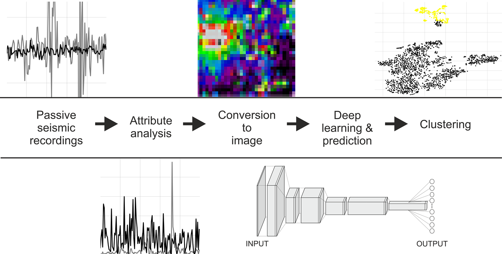

# ansi_selector
## Automatic data selection algorithm for ambient noise seismic interferometry

Passive seismic experiments have been proposed as a cost-effective and non-invasive alternative to controlled-source seismology, allowing body–wave reflections based on seismic interferometry principles to be retrieved. However, from the huge volume of the recorded ambient noise, only selected time periods (noise panels) are contributing constructively to the retrieval of reflections. We address the issue of automatic scanning of ambient noise data recorded by a large-N array in search of body–wave energy (body–wave events) utilizing a convolutional neural network (CNN). It consists of computing first both amplitude and frequency attribute values at each receiver station for all divided portions of the recorded signal (noise panels). The created 2-D attribute maps are then converted to images and used to extract spatial and temporal patterns associated with the body–wave energy present in the data to build binary CNN-based classifiers. The ensemble of two multi-headed CNN models trained separately on the frequency and amplitude attribute maps demonstrates better generalization ability than each of its participating networks. We also compare the prediction performance of our deep learning (DL) framework with a conventional machine learning (ML) algorithm called XGBoost. The DL-based solution applied to 240 h of ambient seismic noise data recorded by the Kylylahti array in Finland demonstrates high detection accuracy and the superiority over the ML-based one. The ensemble of CNN-based models managed to find almost three times more verified body–wave events in the full unlabelled dataset than it was provided at the training stage. Moreover, the high-level abstraction features extracted at the deeper convolution layers can be used to perform unsupervised clustering of the classified panels with respect to their visual characteristics.

This repository contains IPython Notebook with sample code and arbitrary ambient noise panels, complementing research artictle about automatic seismic event detection using Convolutional Neural Networks for long passive seismic recordings acquaired with large N-arrays.

https://doi.org/10.3390/rs13030389

You can view **"training.ipynb"** and **"prediction.ipynb"** directly on GitHub, or clone the repository, install dependencies listed in the notebook and play with code locally.

# Graphical abstract

